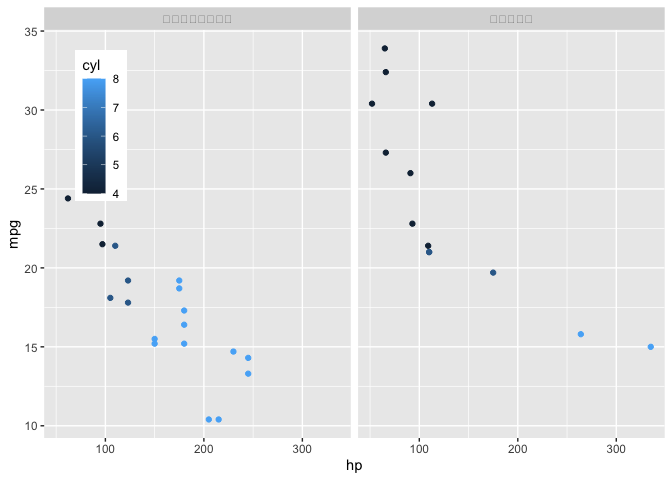
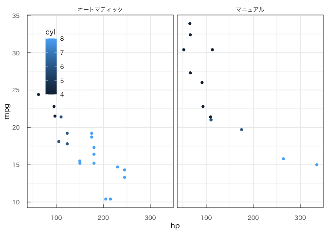
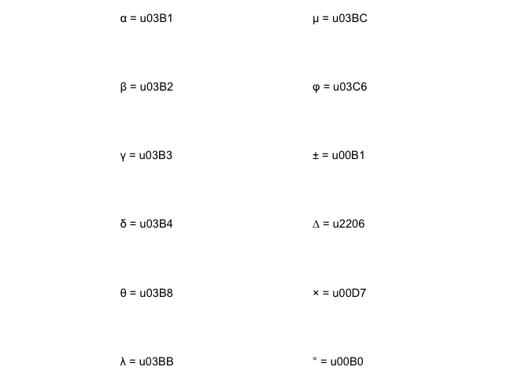
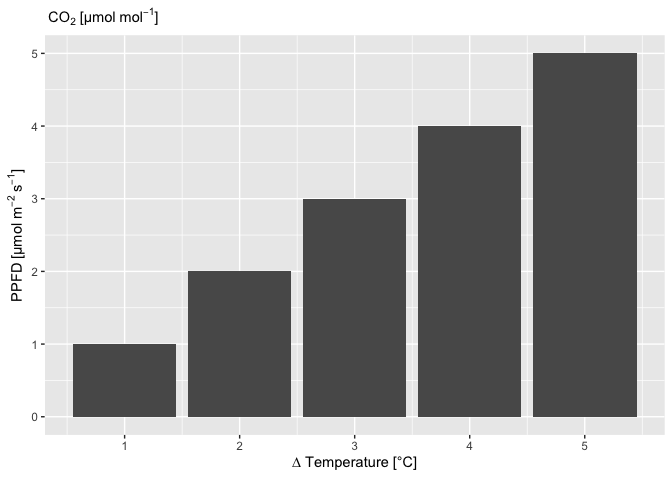

<!-- README.md is generated from README.Rmd. Please edit that file -->

# funkea

<!-- badges: start -->

<!-- badges: end -->

``` r
library(tidyverse)
#> ── Attaching core tidyverse packages ──────────────────────── tidyverse 2.0.0 ──
#> ✔ dplyr     1.1.4     ✔ readr     2.1.5
#> ✔ forcats   1.0.0     ✔ stringr   1.5.1
#> ✔ ggplot2   4.0.0     ✔ tibble    3.3.0
#> ✔ lubridate 1.9.4     ✔ tidyr     1.3.1
#> ✔ purrr     1.1.0     
#> ── Conflicts ────────────────────────────────────────── tidyverse_conflicts() ──
#> ✖ dplyr::filter() masks stats::filter()
#> ✖ dplyr::lag()    masks stats::lag()
#> ℹ Use the conflicted package (<http://conflicted.r-lib.org/>) to force all conflicts to become errors
library(funkea)
```

## ggplot theme

``` r
p <-
  mtcars |>
  mutate(am = if_else(am == 0, "オートマティック", "マニュアル")) |>
  ggplot(aes(hp, mpg, col = cyl)) +
  theme_grey() +
  geom_point() +
  facet_wrap(~ am)

p + 
  legend_topleft()
```



``` r

p +
  theme_funkea() +
  legend_topleft() # = p + theme_bw() + inwart_tick() + transparent + jpn
```



## ggplot label

- `gglabel`にラベルに頻用する単位をまとめる
  - text引数で単位以外の部分を記述
  - expression記法する場合は`~`スタート
  - `see_unicode()`で主要なunicodeを確認

``` r
see_unicode()
```



``` r
tibble(x = 1:5) |>
  ggplot(aes(x, x)) +
  geom_col() +
  labs(x = gglabel("\u2206 Temperature", type = "degC"),
       y = gglabel("PPFD", type = "muflux"),
       subtitle = gglabel(~CO[2], type = "muconc"))
```



## zero filling

- 整数部桁揃え
  - 内部的には`str_pad`

``` r
x <- c(1, 20, 100, NA)
lead_zero(x, 1)
#> [1] "1"   "20"  "100" NA
lead_zero(x, 2)
#> [1] "01"  "20"  "100" NA
lead_zero(x, 3)
#> [1] "001" "020" "100" NA
```

- 小数点以下揃え
  - 内部的には`sprintf`

``` r
y <- c(0.1, 0.001, 0.09, NA)
tail_zero(y, 1)
#> [1] "0.1" "0.0" "0.1" NA
tail_zero(y, 2)
#> [1] "0.10" "0.00" "0.09" NA
tail_zero(y, 3)
#> [1] "0.100" "0.001" "0.090" NA
```
