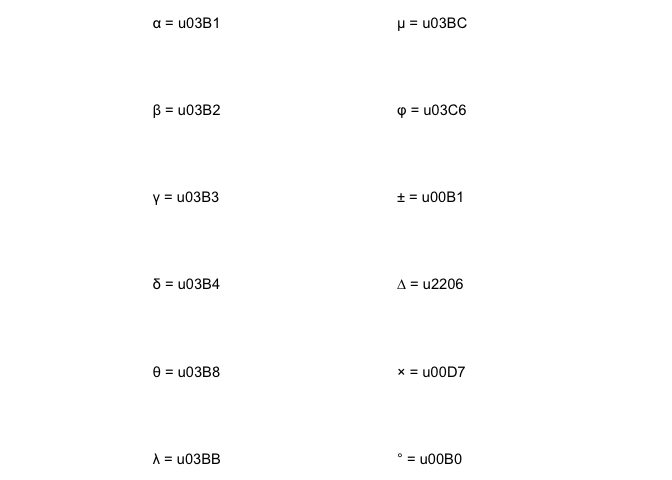

<!-- README.md is generated from README.Rmd. Please edit that file -->

# funkea

<!-- badges: start -->

<!-- badges: end -->

``` r
library(funkea)
```

## ggplot theme

``` r
p <-
  mtcars %>%
  mutate(am = if_else(am == 0, "オートマティック", "マニュアル")) %>%
  ggplot(aes(hp, mpg, col = cyl)) +
  theme_grey() +
  geom_point() +
  facet_wrap(~ am)

p + 
  legend_topleft()
```


``` r

p +
  theme_funkea() +
  legend_topleft() # = p + theme_bw() + inwart_tick() + transparent + jpn
```


## ggplot label

  - `gglabel`にラベルに頻用する単位をまとめる
      - text引数で単位以外の部分を記述
      - expression記法する場合は`~`スタート
      - `see_unicode()`で主要なunicodeを確認

<!-- end list -->

``` r
see_unicode()
```



``` r
qplot(1:5) + theme_bw() +
  labs(x = gglabel("\u2206 Temperature", type = "degC"),
       y = gglabel("PPFD", type = "muflux"),
       subtitle = gglabel(~CO[2], type = "muconc"))
#> `stat_bin()` using `bins = 30`. Pick better value with `binwidth`.
```


## zero filling

  - 整数部桁揃え
      - 内部的には`str_pad`

<!-- end list -->

``` r
x <- c(1, 20, 100, NA)
lead_zero(x, 1)
#> [1] "1"   "20"  "100" NA
lead_zero(x, 2)
#> [1] "01"  "20"  "100" NA
lead_zero(x, 3)
#> [1] "001" "020" "100" NA
```

  - 小数点以下揃え
      - 内部的には`sprintf`

<!-- end list -->

``` r
y <- c(0.1, 0.001, 0.09, NA)
tail_zero(y, 1)
#> [1] "0.1" "0.0" "0.1" NA
tail_zero(y, 2)
#> [1] "0.10" "0.00" "0.09" NA
tail_zero(y, 3)
#> [1] "0.100" "0.001" "0.090" NA
```
